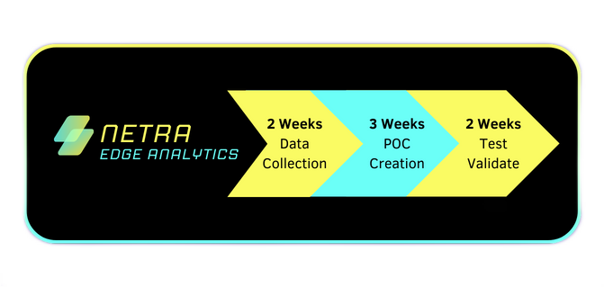
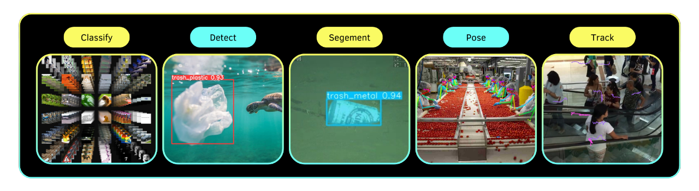

# Netra 

## AI-Enabled Smart Imaging Device for MSMEs

Welcome to Netra, the cutting-edge AI-powered solution designed to revolutionize the way Medium, Small, and Micro Enterprises (MSMEs) operate. With Netra, unleash the power of artificial intelligence to automate tasks, enhance productivity, and ensure safety across various industries.

## How Netra Works

1. **Installation**: Netra seamlessly integrates into your existing infrastructure.
2. **Data Collection**: Netra gathers data over time, learning and adapting to your environment.
3. **Netra Edge Analytics (Cloud Platform)**: Our cloud platform processes the collected data, providing actionable insights.
4. **Proof of Concept (POC)**: We develop a POC to showcase the potential of Netra in your specific use case.
5. **Deployment & Testing**: Once approved, Netra is deployed with rigorous testing to ensure reliability and accuracy.
6. **Continuous Improvement**: We continuously refine and enhance Netra's capabilities based on feedback and real-world usage.

## Netra Edge Analytics Services

- **Data Collection**: Gather data from Netra devices securely and efficiently.
- **Data Pre-processing**: Clean, preprocess, and transform raw data for analysis.
- **Data Annotation**: Annotate data to train machine learning models effectively.
- **Model Deployment**: Deploy trained models onto Netra devices seamlessly.

## Supported Tasks

## Where?

| Category         | Features                                                 |
|------------------|----------------------------------------------------------|
| Manufacturing    | 🏭 Product Counting: Track inventory levels with precision.   🔍 Defect Detection: Identify flaws in products accurately.   📋 SOP Compliance: Ensure adherence to industry standards seamlessly. |
| Logistics/Transportation | 🚚 Worker Safety Monitoring: Ensure the safety of your workforce in real-time.   🛒 Vehicle Stability: Optimize loading operations and prevent accidents. |
| Petrochemicals   | ⚠️ Accident Prevention: Mitigate risks associated with hazardous chemical handling. |
| Security         | 🔒 Real-time Alerts: Stay ahead of potential threats with proactive notifications. |
| Retail           | 🛍️ Customer Behavior Analysis: Gain insights into consumer behavior for informed decision-making. |
| Custom Use Cases | 🔧 Tailored Solutions: Adapt to your unique business needs with custom implementations. |

## Use Cases & Demo Videos

| Use Case                   | Demo Video Link                                  |
|----------------------------|--------------------------------------------------|
| Product Counting           | [Watch Demo](Output/candy.mp4)   |
| SOP Compaliance   | [Watch Demo](Output/SOP.mp4)  |
| Logistic -  Container finding  | [Watch Demo](Output/logistic.mp4)  |
| Under Water plastic detection  | [Watch Demo](Output/ocean.mp4)  |
| Minmum worker| [Watch Demo](Output/min_worker.mp4) |

## Advantages of Netra

- **Innovative Design**: Utilize state-of-the-art hardware and software for unparalleled performance.
- **Scalable Solutions**: Grow your business with ease, knowing Netra can scale alongside your operations.
- **Future-Ready**: Stay ahead of the curve with cutting-edge technology and continuous updates.
- **Intelligent Automation**: Streamline processes and improve efficiency through AI-driven automation.

### Setup Instructions

1. Install Netra within your premises following the provided guidelines.
2. Connect Netra to the Netra Edge Analytics platform for seamless data integration.
3. Customize Netra settings to align with your business objectives and requirements.

## License

This project is licensed under the [MIT License](https://opensource.org/licenses/MIT).
